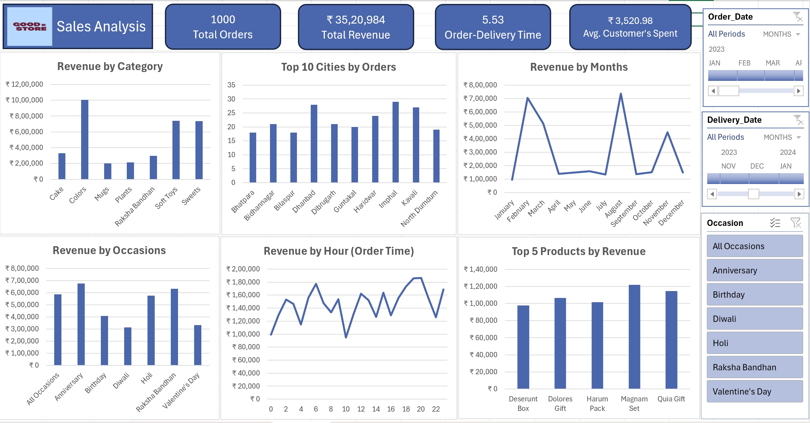

# 📊 Sales Analysis Dashboard | Excel

<p align="center">
  
</p>

## 📌 Project Overview

The **Sales Analysis Dashboard** is an interactive Excel dashboard developed to analyze sales performance using data from **Products, Customers, and Orders** datasets.

This project was created as part of my learning journey in **Data Analytics and Business Intelligence**. I wanted to take raw business data and transform it into a structured, interactive dashboard that could provide useful insights for decision-making.

The project uses **Microsoft Excel**, with **Power Query** for data cleaning and transformation and **Pivot Tables/Pivot Charts** for analysis and visualization.

---

## 🎯 Project Objective

The primary objective of this project was to transform raw sales data into an interactive dashboard that provides a clear overview of business performance.

The dashboard was designed to answer questions such as:

- How much revenue has been generated?
- How many orders have been placed?
- Which product categories generate the most revenue?
- Which cities have the highest order volumes?
- Which months generate the highest revenue?
- Which occasions contribute the most revenue?
- Which products are the top revenue generators?
- At what times of the day is revenue relatively higher?
- What is the average customer spend?
- What is the average order-to-delivery time?

---

## 🧠 Project Background

While learning **Excel for Data Analytics**, I wanted to move beyond individual Excel functions and practice a complete analytical workflow.

I started with three separate datasets:

1. **Products**
2. **Customers**
3. **Orders**

Instead of analyzing these datasets separately, I combined and transformed the information using **Power Query** and then used **Pivot Tables and Pivot Charts** to build an interactive sales dashboard.

This project helped me understand how raw data can be transformed into a business-oriented reporting solution.

---

## 🗂️ Datasets

The project uses three source datasets:

### Products

Contains information related to the products available in the sales data.

### Customers

Contains customer-related information used to understand customer and purchasing activity.

### Orders

Contains transactional/order information used as the primary source for sales analysis.

The datasets are available in the [`data/`](data/) folder.

---

## 🔄 Data Analysis Workflow

The project follows the workflow below:

```text
Products Dataset
       │
Customers Dataset
       │
Orders Dataset
       ↓
    Get Data
       ↓
   Power Query
       ↓
Data Cleaning &
Transformation
       ↓
   Pivot Tables
       ↓
   Pivot Charts
       ↓
Interactive Dashboard
       ↓
Business Insights
```

---

## 🧹 Data Preparation

The datasets were imported into Excel using **Get Data** and then processed using **Power Query**.

The preparation stage included data corrections and transformations required to make the datasets suitable for analysis.

After the data was prepared, the transformed data was used to create Pivot Tables and Pivot Charts.

---

## 📊 Dashboard Overview

The dashboard provides an interactive overview of sales performance.

### Key Performance Indicators

| KPI | Value |
|---|---:|
| **Total Orders** | **1,000** |
| **Total Revenue** | **₹35,20,984** |
| **Average Order-Delivery Time** | **5.53** |
| **Average Customer Spend** | **₹3,520.98** |

> **Note:** The dashboard displays the order-delivery measure as 5.53, but the unit is not explicitly specified.

---

## 📈 Dashboard Analysis

### Revenue by Category

The dashboard compares revenue generated across different product categories.

**Colors** is the highest-revenue category at approximately **₹10 lakh**, followed by **Soft Toys** and **Sweets**.

This visualization helps identify categories that contribute more significantly to overall revenue.

---

### Top 10 Cities by Orders

The dashboard identifies the cities with the highest number of orders.

Among the displayed cities, **Imphal** has the highest order volume, followed by **Dhanbad** and **Kavali**.

> This visualization measures **order volume**, not revenue. A city with fewer orders could still generate higher revenue if its average order value is greater.

---

### Revenue by Month

Monthly revenue shows considerable variation throughout the year.

The dashboard shows notable revenue peaks around:

- **February**
- **August**
- **November**

These variations may indicate seasonal or occasion-driven demand and provide areas for further investigation.

---

### Revenue by Occasion

The dashboard analyzes revenue across different occasions, including:

- Anniversary
- Birthday
- Diwali
- Holi
- Raksha Bandhan
- Valentine's Day

Among the displayed occasions, **Anniversary** and **Raksha Bandhan** are major revenue contributors.

This analysis can help businesses understand the importance of occasion-based purchasing.

---

### Revenue by Order Hour

The dashboard analyzes revenue based on the hour at which orders were placed.

Revenue appears relatively strong during the evening, particularly around:

**18:00 – 20:00**

This could be useful when considering promotional timing, customer engagement, and operational planning.

---

### Top 5 Products by Revenue

The dashboard highlights the five highest-revenue-generating products.

The displayed top products are:

1. **Magnam Set**
2. **Quia Gift**
3. **Dolores Gift**
4. **Harum Pack**
5. **Deserunt Box**

**Magnam Set** is the highest-revenue product among the displayed top five.

---

## 🎛️ Interactive Dashboard Features

The dashboard includes interactive filters that allow users to explore the data from different perspectives.

### Available Filters

- **Order Date**
- **Delivery Date**
- **Occasion**

These filters allow users to move from an overall business view to a more focused analysis.

For example, users can analyze sales for a particular occasion or time period without manually changing the underlying analysis.

---

## 💡 Key Business Insights

Based on the completed dashboard, several observations can be made:

### 1. Revenue is concentrated across certain categories

The **Colors** category contributes the highest revenue among the displayed categories.

### 2. Occasion-based sales are important

**Anniversary** and **Raksha Bandhan** are among the strongest occasion-related revenue contributors.

### 3. Revenue varies significantly by month

February, August, and November show prominent revenue peaks compared with several other months.

### 4. Evening hours show stronger revenue

The dashboard indicates relatively strong revenue during the evening, particularly around 18:00–20:00.

### 5. Multiple cities contribute to order volume

Imphal, Dhanbad, and Kavali are among the leading cities by order volume in the displayed top 10.

### 6. Several products contribute meaningfully to revenue

The top five products have relatively close revenue levels, with Magnam Set leading the group.

### 7. Delivery performance can be monitored

The dashboard provides an average order-to-delivery measure of **5.53**, creating an operational KPI that can be monitored over time.

---

## 💼 Business Recommendations

Based on the available dashboard analysis, the following areas could be explored:

### Focus on high-performing categories

Investigate the factors contributing to the strong performance of categories such as Colors, Soft Toys, and Sweets.

### Prepare for important occasions

Inventory and marketing strategies could be aligned with high-performing occasions such as Anniversary and Raksha Bandhan.

### Investigate seasonal revenue peaks

Further analysis could determine whether the February, August, and November peaks are associated with specific products, occasions, promotions, or customer behavior.

### Optimize evening activity

The business could test targeted promotions or customer engagement strategies during higher-revenue evening periods.

### Analyze cities using revenue as well as orders

Future analysis should compare **revenue, order count, and average order value by city** rather than relying only on order volume.

### Monitor delivery performance

Delivery time could be analyzed by city, product, and occasion to identify potential operational improvements.

---

## 🛠️ Tools & Technologies

| Tool / Feature | Purpose |
|---|---|
| **Microsoft Excel** | Data analysis and dashboard development |
| **Power Query** | Data cleaning and transformation |
| **Pivot Tables** | Data aggregation and analysis |
| **Pivot Charts** | Data visualization |
| **Slicers / Filters** | Interactive dashboard analysis |

---

## 📁 Repository Structure

```text
Excel-Sales-Dashboard/
│
├── README.md
├── LICENSE
├── .gitignore
│
├── data/
│   ├── products.csv
│   ├── customers.csv
│   ├── orders.csv
│   └── README.md
│
├── excel/
│   ├── Sales_Analysis.xlsx
│   └── README.md
│
├── dashboard/
│   ├── sales_analysis_dashboard.png
│   └── README.md
│
└── documentation/
    ├── Excel_Sales_Dashboard_Executive_Summary.pdf
    └── README.md
```

---

## 📂 Project Files

### 📊 Excel Workbook

The complete interactive Excel dashboard is available in the [`excel/`](excel/) folder.

**File:** `Sales_Analysis.xlsx`

The workbook contains the data preparation, Pivot Tables, analysis, and interactive dashboard.

### 📷 Dashboard Preview

A preview of the completed dashboard is available in the [`dashboard/`](dashboard/) folder.

### 📄 Executive Summary

A detailed executive summary of the project, findings, and recommendations is available in the [`documentation/`](documentation/) folder.

### 📁 Source Data

The original datasets used in the project are available in the [`data/`](data/) folder.

---

## ▶️ How to Use

### 1. Download the Project

Clone the repository:

```bash
git clone https://github.com/your-username/Excel-Sales-Dashboard.git
```

### 2. Open the Excel Workbook

Navigate to:

```text
excel/Sales_Dashboard.xlsx
```

Open the workbook using **Microsoft Excel**.

### 3. Explore the Dashboard

Use the available filters and slicers to explore:

- Order periods
- Delivery periods
- Occasions
- Revenue trends
- Product performance
- Geographic order activity

---

## 📌 Important Note

The dashboard is an **analytical and learning project** created to demonstrate practical Excel data-analysis skills.

The insights presented in this repository are based on the available datasets and dashboard visualizations. Where the dashboard does not provide enough information to establish a specific cause, the observation is presented as an area for further investigation rather than a confirmed business conclusion.

---

## 🚀 Future Improvements

Potential future improvements include:

- Adding more advanced Excel calculations
- Creating additional customer-level analysis
- Adding revenue by city
- Calculating Average Order Value by city and product
- Adding customer segmentation
- Adding year-over-year growth analysis
- Adding additional KPIs
- Introducing automated refresh workflows
- Recreating the dashboard in Power BI
- Comparing Excel dashboard results with a Power BI implementation

---

## 📚 Learning Outcomes

Through this project, I gained practical experience in:

- Importing data into Excel
- Power Query
- Data cleaning and transformation
- Combining multiple datasets
- Pivot Tables
- Pivot Charts
- Dashboard design
- Interactive filters and slicers
- KPI development
- Business-oriented data analysis
- Translating data into actionable insights

---

## 👤 Author

**Bhupesh Masram**

Aspiring Data Analyst | Data Analytics & Machine Learning Enthusiast

This project is part of my ongoing journey to develop practical skills in **Excel, SQL, Python, Power BI, Tableau, and Machine Learning**.

---

## ⭐ If you found this project useful

Feel free to explore the repository, review the Excel workbook, and check out the other projects in my portfolio.
